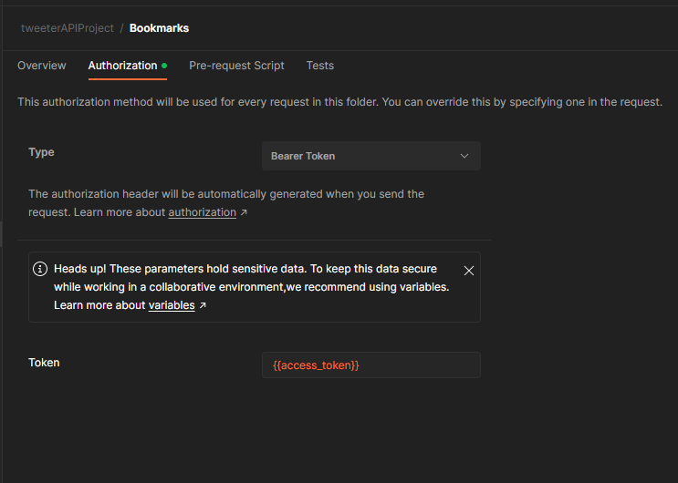
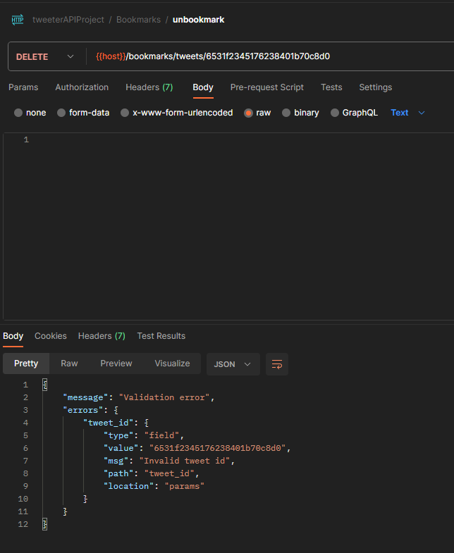

# Chức năng Tweet

## 1. xây dựng Tweet Schema

- trong `models > schemas` tạo file `Tweet.schema.js` để định nghĩa Tweet Schema

  ```ts
  import { ObjectId } from 'mongodb'
  import { TweetAudience, TweetType } from '~/constants/enums'
  import { Media } from '../Other'

  interface TweetConstructor {
    _id?: ObjectId
    user_id: ObjectId
    type: TweetType
    audience: TweetAudience
    content: string
    parent_id: null | string
    hashtags: ObjectId[]
    mentions: string[]
    medias: Media[]
    guest_views?: number
    user_views?: number
    created_at?: Date
    updated_at?: Date
  }

  export default class Tweet {
    _id?: ObjectId
    user_id: ObjectId
    type: TweetType
    audience: TweetAudience
    content: string
    parent_id: null | ObjectId
    hashtags: ObjectId[]
    mentions: ObjectId[]
    medias: Media[]
    guest_views: number
    user_views: number
    created_at: Date
    updated_at: Date
    constructor(tweet: TweetConstructor) {
      const data = new Date()
      this._id = tweet._id
      this.user_id = tweet.user_id
      this.type = tweet.type
      this.audience = tweet.audience
      this.content = tweet.content
      this.parent_id = tweet.parent_id ? new ObjectId(tweet.parent_id) : null
      this.hashtags = tweet.hashtags
      this.mentions = tweet.mentions.map((item) => new ObjectId(item))
      this.medias = tweet.medias
      this.guest_views = tweet.guest_views || 0
      this.user_views = tweet.user_views || 0
      this.created_at = tweet.created_at || data
      this.updated_at = tweet.updated_at || data
    }
  }
  ```

- thêm enum của `TweetType`, `TweetAudience` vào file `enums.ts`

  ```ts
  export enum TweetType {
    Tweet,
    Retweet,
    Comment,
    QuoteTweet
  }

  export enum TweetAudience {
    Everyone,
    TwitterCircle
  }
  ```

# tạo route create tweet

- Trong folder `routes` tạo `tweets.routes.ts`

  ```ts
  import { Router } from 'express'
  import { accessTokenValidator, verifiedUserValidator } from '~/middlewares/users.middlewares'
  import { wrapAsync } from '~/utils/handlers'
  const tweetsRouter = Router()
  /*
  des: create tweets
  method: post
  headers: {Authorization: Bearer <access_token>}
  body: TweetRequestBody
  
  khi muốn đăng một bài tweet thì client sẽ gữi lên server một request có body  như 
  TweetRequestBody(ta chưa làm) kém theo access_token để biết ai là người đăng bài
  
  */

  tweetsRouter.post(
    '/',
    accessTokenValidator,
    verifiedUserValidator,
    createTweetValidator,
    wrapAsync(createTweetController)
  )

  //createTweetValidator và createTweetController ta chưa làm

  export default tweetsRouter
  ```

- trong `index.ts` ta xài `tweetsRouter`

  ```ts
  import tweetsRouter from './routes/tweets.routes'
  ...
  app.use('/tweets', tweetsRouter) //route handler
  ```

- trong folder `models > requests` tạo file `Tweet.request.ts`

  ```ts
  import { TweetAudience, TweetType } from '~/constants/enums'
  import { Media } from '../Other'

  export interface TweetRequestBody {
    type: TweetType
    audience: TweetAudience
    content: string
    parent_id: null | string // k là ObjectId vì
    hashtags: string[] //người dùng truyền lên dạng string,
    mentions: string[] //mình sẽ convert sang ObjectId sau
    medias: Media[]
  }
  ```

- ta sẽ làm middleware `createTweetValidator` để validate request body của client

  - ta có các yêu cầu sau về validator cho 1 bài tweets:

    - `audience` là 1 trong 2 giá trị của `TweetAudience`, nhưng `TweetAudience` là enum
    - `type` là 1 trong 4 giá trị của `TweetType`, nhưng `TweetType` là enum
    - nếu `type` là `retweet` , `comment` , `quotetweet` thì `parent_id` phải là `tweet_id` của tweet cha
    - nếu `type` là `tweet` thì `parent_id` phải là `null`
    - nếu `type` là `retweet` thì `content` phải là `''`
    - nếu `type` là `tweet` , `comment` , `quotetweet` và không có mention hay hashtag thì `content` phải là string và không được rỗng
    - `hashtags` là mảng các string
    - `mentions` là mảng các string dạng id
    - `medias` là mảng các `Media`

    - từ phần tích trên ta **ta cần 1 hàm biến đổi từ enum sang array các giá trị số của enum**, trong folder `utils` và tạo file `commons.ts`

      đây là object enum `TweetType`
      
      nên ta phải xử lý như sau

      ```ts
      //hàm xử lý enum đc mảng các số của enum
      export const numberEnumToArray = (numberEnum: { [key: string]: string | number }) => {
        return Object.values(numberEnum).filter((value) => typeof value === 'number') as number[]
      }
      ```

- trong folder `middlewares` tạo file `tweets.middlewares.ts` và trong đó tao code `createTweetValidator`

  ```ts
  import { Request, Response, NextFunction } from 'express'
  import { checkSchema } from 'express-validator'
  import { isEmpty } from 'lodash'
  import { ObjectId } from 'mongodb'
  import { MediaType, TweetAudience, TweetType } from '~/constants/enums'
  import { TWEETS_MESSAGES } from '~/constants/messages'
  import { numberEnumToArray } from '~/utils/commons'
  import { validate } from '~/utils/validation'

  const tweetTypes = numberEnumToArray(TweetType) //kq có dạng [0, 1, 2, 3]
  const tweetAudiences = numberEnumToArray(TweetAudience) //kq có dạng [0, 1]
  const mediaTypes = numberEnumToArray(MediaType) //kq có dạng [0, 1]
  export const createTweetValidator = validate(
    checkSchema(
      {
        type: {
          isIn: {
            options: [tweetTypes], //doc bảo là phải truyền [[0,1,2,3]]
            errorMessage: TWEETS_MESSAGES.INVALID_TYPE
          }
        },
        audience: {
          isIn: {
            options: [tweetAudiences],
            errorMessage: TWEETS_MESSAGES.INVALID_AUDIENCE
          }
        },
        parent_id: {
          custom: {
            options: (value, { req }) => {
              const type = req.body.type as TweetType
              //nếu `type` là `retweet` , `comment` , `quotetweet` thì `parent_id` phải là `tweet_id` của tweet cha
              if (
                [TweetType.Retweet, TweetType.Comment, TweetType.QuoteTweet].includes(type) &&
                !ObjectId.isValid(value)
              ) {
                throw new Error(TWEETS_MESSAGES.PARENT_ID_MUST_BE_A_VALID_TWEET_ID)
              }
              // nếu `type` là `tweet` thì `parent_id` phải là `null`
              if (type == TweetType.Tweet && value != null) {
                throw new Error(TWEETS_MESSAGES.PARENT_ID_MUST_BE_NULL)
              }
              //oke thì trả về true
              return true
            }
          }
        },
        content: {
          isString: true,
          custom: {
            options: (value, { req }) => {
              const type = req.body.type as TweetType
              const mentions = req.body as string[] //không dùng destructuring vì không định nghĩa kiểu dữ liệu được
              const hashtags = req.body as string[]
              //nếu `type` là `tweet` , `comment` , `quotetweet` và không có mention hay hashtag thì `content` phải là string và không được rỗng
              if (
                [TweetType.Tweet, TweetType.Comment, TweetType.QuoteTweet].includes(type) &&
                isEmpty(mentions) &&
                isEmpty(hashtags) &&
                value.trim() == ''
              ) {
                //isEmpty() của lodash
                throw new Error(TWEETS_MESSAGES.CONTENT_MUST_BE_A_NON_EMPTY_STRING)
              }
              // nếu `type` là `retweet` thì `content` phải là `''`
              if (type == TweetType.Retweet && value != '') {
                throw new Error(TWEETS_MESSAGES.CONTENT_MUST_BE_EMPTY_STRING)
              }
              //oke thì trả về true
              return true
            }
          }
        },
        hashtags: {
          isArray: true,
          custom: {
            options: (value, { req }) => {
              //yêu cầu mỗi phần tử trong array phải là string
              if (value.some((item: any) => typeof item !== 'string')) {
                throw new Error(TWEETS_MESSAGES.HASHTAGS_MUST_BE_AN_ARRAY_OF_STRING)
              }
              //oke thì trả về true
              return true
            }
          }
        },
        mentions: {
          isArray: true,
          custom: {
            options: (value, { req }) => {
              //yêu cầu mỗi phần tử trong array phải là user_id
              if (value.some((item: any) => !ObjectId.isValid(item))) {
                throw new Error(TWEETS_MESSAGES.MENTIONS_MUST_BE_AN_ARRAY_OF_user_id)
              }
              //oke thì trả về true
              return true
            }
          }
        },
        medias: {
          isArray: true,
          custom: {
            options: (value, { req }) => {
              //yêu cầu mỗi phần tử trong array phải là Media Object
              if (
                value.some((item: any) => {
                  return typeof item.url !== 'string' || !mediaTypes.includes(item.type)
                })
              ) {
                throw new Error(TWEETS_MESSAGES.MEDIAS_MUST_BE_AN_ARRAY_OF_MEDIA_OBJECT)
              }
              //oke thì trả về true
              return true
            }
          }
        }
      },

      ['body']
    )
  )
  ```

  - trong file `messages.ts` phải thêm

        ```ts
        export const TWEETS_MESSAGES = {
        INVALID_TYPE: 'Invalid type',
        INVALID_AUDIENCE: 'Invalid audience',
        PARENT_ID_MUST_BE_A_VALID_TWEET_ID: 'Parent id must be a valid tweet id',
        PARENT_ID_MUST_BE_NULL: 'Parent id must be null',
        CONTENT_MUST_BE_NULL: 'Content must be null',
        CONTENT_MUST_BE_A_NON_EMPTY_STRING: 'Content must be a non-empty string',
        HASHTAGS_MUST_BE_AN_ARRAY_OF_STRING: 'Hashtags must be an array of string',
        MENTIONS_MUST_BE_AN_ARRAY_OF_user_id: 'Mentions must be an array of user id',
        MEDIAS_MUST_BE_AN_ARRAY_OF_MEDIA_OBJECT: 'Medias must be an array of media object'
        }
        ```

- trong folder `controllers` tạo file `tweets.controllers.ts` code tạm để test middleware, sau khi test ta sẽ bổ sung sau

  ```ts
  import { Request, Response } from 'express'
  import { ParamsDictionary } from 'express-serve-static-core'
  import { TweetRequestBody } from '~/models/requests/Tweet.requests'

  export const createTweetController = (req: Request<ParamsDictionary, any, TweetRequestBody>, res: Response) => {
    return res.status(200).json({
      message: 'createTweetValidator'
    })
  }
  ```

- test code
- tạo folder `Tweets`
  
- chạy login trước khi đăng bài
  
- add request mới
  
- đổi type về 0 để test
  

# tiến hành code createTweetController

- trong `database.services.ts` tạo method `tweets` để lấy collection `tweets`

  ```ts
  class DatabaseService {
    ...
    get tweets(): Collection<Tweet> {
        return this.db.collection(process.env.DB_TWEETS_COLLECTION as string)
    }
    //trong đó DB_TWEETS_COLLECTION lưu ở .env là 'tweets'
    ...
  }
  ```

- fix lại `createTweetControllers`

  ```ts
  export const createTweetController = async (req: Request<ParamsDictionary, any, TweetRequestBody>, res: Response) => {
    const { user_id } = req.decoded_authorization as TokenPayload
    //lấy dể biết ai là người đăng
    const body = req.body // và đăng cái gì
    const result = await tweetsService.createTweet(user_id, body) //createTweet chưa code
    res.json({
      message: TWEETS_MESSAGES.TWEET_CREATED_SUCCESSFULLY, // thêm TWEET_CREATED_SUCCESSFULLY: 'Tweet created success'
      result
    })
  }
  ```

- trong folder `services` tạo `tweets.services.ts`

  ```ts
  import { TweetRequestBody } from '~/models/requests/Tweet.requests'
  import databaseService from './database.services'
  import Tweet from '~/models/schemas/Tweet.schema'
  import { ObjectId } from 'mongodb'

  class TweetsService {
    async createTweet(user_id: string, body: TweetRequestBody) {
      const result = await databaseService.tweets.insertOne(
        new Tweet({
          audience: body.audience,
          content: body.content,
          hashtags: [], //mình sẽ xử lý logic nó sau, nên tạm thời truyền rỗng
          mentions: body.mentions, //dưa mình string[], mình bỏ trực tiếp vào contructor, nó sẽ convert sang ObjectId[] cho mình
          medias: body.medias,
          parent_id: body.parent_id,
          type: body.type,
          user_id: new ObjectId(user_id) //người tạo tweet
        })
      )

      //lấy tweet vừa tạo ra
      const tweet = await databaseService.tweets.findOne({ _id: result.insertedId })
      return tweet
    }
  }

  const tweetsService = new TweetsService()
  export default tweetsService
  ```

- test code
  - login
    
  - đăng bài
    
  - kiểm tra kết quả
    
  - dùng user_id để xem có phải mình đã đăng bài hay không
    

# Tweet schema validation

```js
{
  "$jsonSchema": {
    "bsonType": "object",
    "title": "tweets object validation",
    "required": [
      "_id",
      "user_id",
      "type",
      "audience",
      "content",
      "parent_id",
      "hashtags",
      "mentions",
      "medias",
      "guest_views",
      "user_views",
      "created_at",
      "updated_at"
    ],
    "properties": {
      "_id": {
        "bsonType": "objectId",
        "description": "'_id' must be a ObjectId and is required"
      },
      "user_id": {
        "bsonType": "objectId",
        "description": "'user_id' must be a ObjectId and is required"
      },
      "type": {
        "bsonType": "int",
        "enum": [0, 1, 2, 3],
        "description": "'type' must be a TweetType and is required"
      },
      "audience": {
        "bsonType": "int",
        "enum": [0, 1],
        "description": "'audience' must be a TweetAudience and is required"
      },
      "content": {
        "bsonType": "string",
        "description": "'content' must be a string and is required"
      },
      "parent_id": {
        "bsonType": ["null", "objectId"],
        "description": "'parent_id' must be a null or ObjectId and is required"
      },
      "hashtags": {
        "bsonType": "array",
        "uniqueItems": true,
        "additionalProperties": false,
        "items": {
          "bsonType": "objectId"
        },
        "description": "'hashtags' must be a array and is required"
      },
      "mentions": {
        "bsonType": "array",
        "uniqueItems": true,
        "additionalProperties": false,
        "items": {
          "bsonType": "objectId"
        },
        "description": "'mentions' must be a array and is required"
      },
      "medias": {
        "bsonType": "array",
        "uniqueItems": true,
        "additionalProperties": false,
        "items": {
          "bsonType": "object",
          "required": ["url", "type"],
          "additionalProperties": false,
          "properties": {
            "type": {
              "enum": [0, 1, 2],
              "description": "'type' is required and can only be one of the given enum values"
            },
            "url": {
              "bsonType": "string",
              "description": "'url' is a required field of type string"
            }
          }
        },
        "description": "'medias' must be a array and is required"
      },
      "guest_views": {
        "bsonType": "int",
        "minimum": 0,
        "description": "'guest_views' must be a ObjectId and is required"
      },
      "user_views": {
        "bsonType": "int",
        "minimum": 0,
        "description": "'user_views' must be a number and is required"
      },
      "created_at": {
        "bsonType": "date",
        "description": "'created_at' must be a date and is required"
      },
      "updated_at": {
        "bsonType": "date",
        "description": "'updated_at' must be a date and is required"
      }
    },
    "additionalProperties": false
  }
}
```

- thêm vào mongoDB đoạn cấu hình trên
  

# tạo hashtags , và xử lý hashtags

- trong folder `models > schemas` tạo schema `Hashtag.schema.ts`

  ```ts
  import { ObjectId } from 'mongodb'

  interface HashtagType {
    _id?: ObjectId
    name: string
    created_at?: Date
  }

  export default class Hashtag {
    _id?: ObjectId
    name: string
    created_at: Date

    constructor(data: HashtagType) {
      this._id = data._id || new ObjectId() // bình thường k có giá trị mặc định này
      this.name = data.name
      this.created_at = data.created_at || new Date()
    }
  }
  //vì: nếu dùng insertOne thì _id sẽ tự tạo, ta k cần giá trị mặc định
  //nhưng tý nữa ta sẽ dùng findOneAndUpdate, và nó k tự có nên ta phải tạo giá trị mặc định _id
  ```

- tạo hàm `get hashtags` trong `database.services.ts`

  ```ts
  class DatabaseService {
    ...
    //tạo DB_HASHTAGS_COLLECTION = 'hashtags' trong file .env
    get hashtags(): Collection<Hashtag> {
      return this.db.collection(process.env.DB_HASHTAGS_COLLECTION as string)
    }
    ...
  }
  ```

- trong `tweets.services.ts` ta sẽ tạo hàm `checkAndCreateHashtags` để xử lý hashtags:

  - nếu client dùng 1 hashtag đã có thì ta sẽ lấy id của hashtag đó
  - nếu client dùng 1 hashtag chưa có thì ta sẽ tạo mới hashtag đó và lấy id của hashtag đó

  ```ts
  class TweetsService {
    ...
    async checkAndCreateHashtags(hashtags: string[]) {
      //findOneAndUpdate giúp ta tìm kiếm và update 1 document ,nếu không có thì sẽ tạo mới,
      //findOneAndUpdate return về id của document đó
      //ta sẽ dùng map để biến đổi các hashtag(string) thành các id của các hashtag tìm đc hoặc tạo mới
      //findOneAndUpdate là promise nên map sẽ trả về 1 mảng các promise, ta sẽ dùng Promise.all để chờ tất cả các promise
      const hashtagDocument = await Promise.all(
        hashtags.map((hashtag) => {
          return databaseService.hashtags.findOneAndUpdate(
            { name: hashtag },
            { $setOnInsert: new Hashtag({ name: hashtag }) },
            { upsert: true }
          )
        })
      )
      // hashtagDocument là mảng các ovject kết quả của findOneAndUpdate từ việc tìm và thêm hashtag
      return hashtagDocument
    }
    ...
    // xài luôn hàm checkAndCreateHashtags trong createTweet
    async createTweet(user_id: string, body: TweetRequestBody) {
      //biến mảng string thành mảng object
      const hashtags = await this.checkAndCreateHashtags(body.hashtags)
      console.log(hashtags) //in ra thử luôn để xem hashtags có gì trước khi code tiếp
      ...
  }
  ```

- test code

  - login
    
  - đăng bài kèm hashtags
    
    
  - ta được log thế này ở **terminal**, vậy biến `hashtags` của ta trông thế này

    ```ts
    ;[
      {
        lastErrorObject: {
          n: 1,
          updatedExisting: false,
          upserted: new ObjectId('6531eb7e519526aa3a2e9e21') //id của hashtag sadboy
        },
        value: null, // nếu hashtag chưa có thì upserted là id của hashtag đó, value là null
        ok: 1,
        $clusterTime: {
          clusterTime: new Timestamp({ t: 1697770367, i: 10 }),
          signature: [Object]
        },
        operationTime: new Timestamp({ t: 1697770367, i: 10 })
      },
      {
        lastErrorObject: {
          n: 1,
          updatedExisting: false,
          upserted: new ObjectId('6531eb7e519526aa3a2e9e22') //id của hashtag cu đơn
        },
        value: null,
        ok: 1,
        $clusterTime: {
          clusterTime: new Timestamp({ t: 1697770367, i: 10 }),
          signature: [Object]
        },
        operationTime: new Timestamp({ t: 1697770367, i: 9 })
      }
    ]
    ```

  - nếu ta đăng lại 1 lần nữa

    ```ts
      [
        {
          lastErrorObject: { n: 1, updatedExisting: true },
          value: {//nếu hashtag đã có trước đó thì value có giá trị còn lastErrorObject mất luôn upserted
            _id: new ObjectId("6531eb7e519526aa3a2e9e21"),
            name: 'sadboy',
            created_at: 2023-10-20T02:52:46.151Z
          },
          ok: 1,
          '$clusterTime': {
            clusterTime: new Timestamp({ t: 1697770930, i: 2 }),
            signature: [Object]
          },
          operationTime: new Timestamp({ t: 1697770930, i: 2 })
        },
        {
          lastErrorObject: { n: 1, updatedExisting: true },
          value: {
            _id: new ObjectId("6531eb7e519526aa3a2e9e22"),
            name: 'cu đơn',
            created_at: 2023-10-20T02:52:46.151Z
          },
          ok: 1,
          '$clusterTime': {
            clusterTime: new Timestamp({ t: 1697770930, i: 2 }),
            signature: [Object]
          },
          operationTime: new Timestamp({ t: 1697770930, i: 2 })
        }
      ]
    ```

  - vậy thì rất khó để lấy id cho hashtag mới tạo, vì nó có thể nằm ở `upserted` hoặc `value._id` ta sẽ fix bằng cách
    thêm thuộc tính `returnDocument: "after"`
    ```ts
    const hashtagDocument = await Promise.all(
      hashtags.map((hashtag) => {
        return databaseService.hashtags.findOneAndUpdate(
          { name: hashtag },
          { $setOnInsert: new Hashtag({ name: hashtag }) },
          { upsert: true, nreturnDocument: 'after' } //thêm vào đây
        )
      })
    )
    ```
  - test lại với hashtag mới "hề hước"
    
  - kết quả log ra của mảng hashtags lúc này

  ```ts
  [
  {
    lastErrorObject: { n: 1, updatedExisting: true },
    value: {//hashtag cũ sẽ có value
      _id: new ObjectId("6531eb7e519526aa3a2e9e21"),
      name: 'sadboy',
      created_at: 2023-10-20T02:52:46.151Z
    },
    ok: 1,
    '$clusterTime': {
      clusterTime: new Timestamp({ t: 1697771418, i: 3 }),
      signature: [Object]
    },
    operationTime: new Timestamp({ t: 1697771418, i: 2 })
  },
  {
    lastErrorObject: { n: 1, updatedExisting: true },
    value: {//hashtag cũ sẽ có value
      _id: new ObjectId("6531eb7e519526aa3a2e9e22"),
      name: 'cu đơn',
      created_at: 2023-10-20T02:52:46.151Z
    },
    ok: 1,
    '$clusterTime': {
      clusterTime: new Timestamp({ t: 1697771418, i: 2 }),
      signature: [Object]
    },
    operationTime: new Timestamp({ t: 1697771418, i: 2 })
  },
  {
    lastErrorObject: {
      n: 1,
      updatedExisting: false,
      upserted: new ObjectId("6531ef991e71ee6bcb83c208")
    },
    value: {//đã có giá trị cho hashtag mới tạo
      _id: new ObjectId("6531ef991e71ee6bcb83c208"),
      name: 'hề hước',
      created_at: 2023-10-20T03:10:17.016Z
    },
    ok: 1,
    '$clusterTime': {
      clusterTime: new Timestamp({ t: 1697771418, i: 3 }),
      signature: [Object]
    },
    operationTime: new Timestamp({ t: 1697771418, i: 3 })
  }
  ]
  ```

- từ đó ta fix lại biến `hashtags` để biến nó thành mảng các ObjectId, vì ta cần id chứ k phải cả object như giá trị ban đầu nên

  ```ts
    async checkAndCreateHashtags(hashtags: string[]) {
      ...
      //bỏ đoạn này vì nó return ra mảng object
      //return hashtagDocument
      //thay thành
      return hashtagDocument.map((item) => (item.value as WithId<Hashtag>)._id)
  }
  ```

- vậy là giờ `hashtag` sẽ là mảng trông như này

```ts
;[
  new ObjectId('6531eb7e519526aa3a2e9e21'),
  new ObjectId('6531eb7e519526aa3a2e9e22'),
  new ObjectId('6531ef991e71ee6bcb83c208')
]
```

- vậy khi tạo bài viết ta sẽ thêm cái này vào

```ts
  async createTweet(user_id: string, body: TweetRequestBody) {
    const hashtags = await this.checkAndCreateHashtags(body.hashtags)
    console.log(hashtags)

    const result = await databaseService.tweets.insertOne(
      new Tweet({
        audience: body.audience,
        content: body.content,
        hashtags//để vậy luôn thì nó sẽ gán hashtags : hashtags
        ...
```

- test lại
  
  

# Bookmark và Like

- chúng ta sẽ làm chức năng `bookmark` và `like` luôn vì chúng giống nhau

## 1. tạo Bookmark

### 1.1 tạo Bookmark

- trong `routes` tạo `bookmarks.routes.ts`

  ```ts
  import { Router } from 'express'
  import { accessTokenValidator, verifiedUserValidator } from '~/middlewares/users.middlewares'
  import { wrapAsync } from '~/utils/handlers'

  const bookmarksRouter = Router()
  /*
      des: bookmark a tweets
      path: / nghĩa là localhost:4000/bookmarks thôi
      method: post
      headers: {Authorization: Bearer <access_token>}
      body: {tweet_id: string}
    */

  bookmarksRouter.post('/', accessTokenValidator, verifiedUserValidator, wrapAsync(bookmarkTweetController)) //bookmarkTweetController chưa làm

  export default bookmarksRouter
  ```

- trong `index.ts` thêm

  ```ts
  app.use('/bookmarks', bookmarksRouter) //route handler
  ```

- trong folder `models > requests` tạo `Bookmark.request.ts`

  ```ts
  export interface BookmarkTweetReqBody {
    tweet_id: string
  }
  ```

- trong folder `controllers` tạo `bookmarks.controllers.ts`

  ```ts
  import { Request, Response } from 'express'
  import { ParamsDictionary } from 'express-serve-static-core'
  import { BookmarkTweetReqBody } from '~/models/requests/Bookmark.request'
  export const bookmarkTweetController = async (
    req: Request<ParamsDictionary, any, BookmarkTweetReqBody>,
    res: Response
  ) => {
    const { user_id } = req.decoded_authorization as TokenPayload
    const { tweet_id } = req.body
    const result = await bookmarksService.createBookmark(user_id, tweet_id) // bookmarksService.createBookmark chưa làm
    return res.json({
      message: BOOKMARK_MESSAGES.BOOKMARK_SUCCESSFULLY, //thêm BOOKMARK_SUCCESSFULLY : 'Bookmark successfully' vào messages.ts
      result
    })
  }
  ```

- trong folder `model>schema` tạo `Bookmark.schema.ts`

  ```ts
  import { ObjectId } from 'mongodb'

  interface BookmarksType {
    _id?: ObjectId
    user_id: ObjectId
    tweet_id: ObjectId
    created_at?: Date
  }

  export class Bookmark {
    _id: ObjectId
    user_id: ObjectId
    tweet_id: ObjectId
    created_at: Date
    constructor(bookmark: BookmarksType) {
      this._id = bookmark._id || new ObjectId()
      this.user_id = bookmark.user_id
      this.tweet_id = bookmark.tweet_id
      this.created_at = bookmark.created_at || new Date()
    }
  }
  ```

- trong `database.services.ts > databasesServices` tạo method `get bookmarks`

  ```ts
    //tạo DB_BOOKMARKS_COLLECTION = 'bookmarks' trong file .env
    get bookmarks(): Collection<Bookmark> {
      return this.db.collection(process.env.DB_BOOKMARKS_COLLECTION as string)
    }
  ```

- trong folder `services` tạo `bookmarks.services.ts`

  ```ts
  import { Bookmark } from '~/models/schemas/Bookmark.schema'
  import databaseService from './database.services'
  import { ObjectId } from 'mongodb'

  class BookmarksService {
    async createBookmark(user_id: string, tweet_id: string) {
      //nếu chưa thì tạo mới, có rồi thì thôi
      const result = await databaseService.bookmarks.findOneAndUpdate(
        { user_id: new ObjectId(user_id), tweet_id: new ObjectId(tweet_id) }, //filter tìm xem có không
        {
          $setOnInsert: new Bookmark({
            user_id: new ObjectId(user_id),
            tweet_id: new ObjectId(tweet_id)
          })
        },
        {
          upsert: true, //nếu không có thì tạo mới
          returnDocument: 'after' //trả về document sau khi update
        }
      )
      return result.value as WithId<Bookmark> //giống cấu trúc của hashtags trước đó
    }
  }
  const bookmarksService = new BookmarksService()
  export default bookmarksService
  ```

- test code
  - login
  - tạo folder
    
  - add request và dùng id của 1 bài tweet bất kỳ, thử bookmark nhiều lần xem có bị thêm nhiều lần vào db không ?
    

### 1.2 unbookmark

- làm chức năng `unbookmark`

- làm route `unbookmark` trong `bookmarks.routes.ts`

  ```ts
  /*
  des: delete a bookmarked tweets
  path: /tweets/:tweet_id thêm /tweets/ để thân thiện với client khi sử dụng tránh hiểu lầm truyền user_id vào params
  method: delete
  headers: {Authorization: Bearer <access_token>}
  body: null vì tweet_id nằm trong url
  và delete thì ngta k cho truyền body
  
  
  */
  bookmarksRouter.delete(
    '/tweets/:tweet_id',
    accessTokenValidator,
    verifiedUserValidator,
    wrapAsync(unbookmarkTweetController)
  ) //unbookmarkTweetController chưa làm
  ```

- trong `bookmarks.controllers.ts` tạo `unbookmarkTweetController`

  ```ts
  export const unbookmarkTweetController = async (
    req: Request<ParamsDictionary, any, any>, //any vì delete thì  k dùng body nên k có định nghĩa
    res: Response
  ) => {
    const { user_id } = req.decoded_authorization as TokenPayload
    const { tweet_id } = req.params //k phải req.body vì tweet_id nằm trong url
    await bookmarksService.unbookmarkTweet(user_id, tweet_id) // unbookmarkTweet chưa làm
    return res.json({
      message: BOOKMARK_MESSAGES.UNBOOKMARK_SUCCESSFULLY //thêm UNBOOKMARK_SUCCESSFULLY: 'Unbookmark successfully' vào messages.ts
    })
  }
  ```

- vào `bookmarks.serivces.ts` thêm method `unbookmarkTweet`

  ```ts
    async unbookmarkTweet(user_id: string, tweet_id: string) {
      const result = await databaseService.bookmarks.findOneAndDelete({
        user_id: new ObjectId(user_id),
        tweet_id: new ObjectId(tweet_id)
      })
      return result
    }
  ```

- test code
  

# middleware `tweetIdValidator`

- ta sẽ làm middleware `tweetIdValidator` để kiểm tra xem client có truyền lên `tweet_id` hợp lệ hay không
- ta sẽ kiểm tra `tweet_id` trong `params` và trong `body` của `request`
- vào `tweets.middlewares.ts` tạo `tweetIdValidator`

  ```ts
  export const tweetIdValidator = validate(
    checkSchema(
      {
        tweet_id: {
          custom: {
            options: async (value, { req }) => {
              //nếu tweet_id không phải objectId thì báo lỗi
              if (!ObjectId.isValid(value)) {
                throw new ErrorWithStatus({
                  status: HTTP_STATUS.BAD_REQUEST, //400
                  message: TWEETS_MESSAGES.INVALID_TWEET_ID //thêm trong messages.ts
                })
              }

              //nếu tweet_id không tồn tại thì báo lỗi
              const tweet = await databaseService.tweets.findOne({
                _id: new ObjectId(value)
              })
              if (!tweet) {
                throw new ErrorWithStatus({
                  status: HTTP_STATUS.NOT_FOUND, //404
                  message: TWEETS_MESSAGES.TWEET_NOT_FOUND //thêm trong messages.ts
                }) //thêm trong messages.ts
              }
              return true
            }
          }
        }
      },
      ['params', 'body']
    )
  )
  ```

- xài `tweetIdValidator` ở route `createBookmark` và `unbookmark`

  ```ts
  bookmarksRouter.post(
    '/',
    accessTokenValidator,
    verifiedUserValidator,
    tweetIdValidator,
    wrapAsync(bookmarkTweetController)
  )

  bookmarksRouter.delete(
    '/tweets/:tweet_id',
    accessTokenValidator,
    verifiedUserValidator,
    tweetIdValidator,
    wrapAsync(unbookmarkTweetController)
  )
  ```

- test
  - thêm 1 số 0 trên tweet_id xem có báo lỗi không
    
  - thử xóa tweets và bookmark tweets bị xóa xem sao
    

## 2. tạo Like

- giống như bookmark khác ở tên mà thôi

- trong `routes` tạo `likes.routes.ts`

  ```ts
  import { Router } from 'express'
  import { accessTokenValidator, verifiedUserValidator } from '~/middlewares/users.middlewares'
  import { wrapAsync } from '~/utils/handlers'

  const likesRouter = Router()
  /*
      des: like a tweets
      path: / nghĩa là localhost:4000/likes thôi
      method: post
      headers: {Authorization: Bearer <access_token>}
      body: {tweet_id: string}
    */

  likesRouter.post('/', accessTokenValidator, verifiedUserValidator, tweetIdValidator, wrapAsync(likeTweetController)) //likeTweetController chưa làm

  export default likesRouter
  ```

- trong `index.ts` thêm

  ```ts
  app.use('/likes', likesRouter) //route handler
  ```

- trong folder `models > requests` tạo `Like.request.ts`

  ```ts
  export interface LikeTweetReqBody {
    tweet_id: string
  }
  ```

- trong folder `controllers` tạo `likes.controllers.ts`

  ```ts
  import { Request, Response } from 'express'
  import { ParamsDictionary } from 'express-serve-static-core'
  import { LikeTweetReqBody } from '~/models/requests/Like.request'
  export const likeTweetController = async (req: Request<ParamsDictionary, any, LikeTweetReqBody>, res: Response) => {
    const { user_id } = req.decoded_authorization as TokenPayload
    const { tweet_id } = req.body
    const result = await likesService.createLike(user_id, tweet_id) // likesService.createLike chưa làm
    return res.json({
      message: LIKE_MESSAGES.LIKE_SUCCESSFULLY, //thêm LIKE_SUCCESSFULLY : 'LIKE successfully' vào messages.ts
      result
    })
  }
  ```

- trong folder `model>schema` tạo `Like.schema.ts`

  ```ts
  import { ObjectId } from 'mongodb'

  interface LikesType {
    _id?: ObjectId
    user_id: ObjectId
    tweet_id: ObjectId
    created_at?: Date
  }

  export class Like {
    _id: ObjectId
    user_id: ObjectId
    tweet_id: ObjectId
    created_at: Date
    constructor(like: LikesType) {
      this._id = like._id || new ObjectId()
      this.user_id = like.user_id
      this.tweet_id = like.tweet_id
      this.created_at = like.created_at || new Date()
    }
  }
  ```

- trong `database.services.ts > databasesServices` tạo method `get likes`

  ```ts
    //tạo DB_LIKES_COLLECTION = 'likes' trong file .env
    get likes(): Collection<Like> {
      return this.db.collection(process.env.DB_LIKES_COLLECTION as string)
    }
  ```

- trong folder `services` tạo `likes.services.ts`

  ```ts
  import { Like } from '~/models/schemas/Like.schema'
  import databaseService from './database.services'
  import { ObjectId } from 'mongodb'

  class LikesService {
    async createLike(user_id: string, tweet_id: string) {
      //nếu chưa thì tạo mới, có rồi thì thôi
      const result = await databaseService.likes.findOneAndUpdate(
        { user_id: new ObjectId(user_id), tweet_id: new ObjectId(tweet_id) }, //filter tìm xem có không
        {
          $setOnInsert: new Like({
            user_id: new ObjectId(user_id),
            tweet_id: new ObjectId(tweet_id)
          })
        },
        {
          upsert: true, //nếu không có thì tạo mới
          returnDocument: 'after' //trả về document sau khi update
        }
      )
      return result.value as WithId<Like> //giống cấu trúc của hashtags trước đó
    }
  }
  const likesService = new LikesService()
  export default likesService
  ```

  ### 1.2 unlike

- làm chức năng `unlike`

- làm route `unlike` trong `likes.routes.ts`

  ```ts
  /*
  des: unlike a tweets
  path: /tweets/:tweet_id thêm /tweets/ để thân thiện với client khi sử dụng tránh hiểu lầm truyền user_id vào params
  method: delete
  headers: {Authorization: Bearer <access_token>}
  body: null vì tweet_id nằm trong url
  và delete thì ngta k cho truyền body
  
  
  */
  likesRouter.delete(
    '/tweets/:tweet_id',
    accessTokenValidator,
    verifiedUserValidator,
    tweetIdValidator,
    wrapAsync(unlikeTweetController)
  ) //unlikeTweetController chưa làm
  ```

- trong `likes.controllers.ts` tạo `unlikeTweetController`

  ```ts
  export const unlikeTweetController = async (
    req: Request<ParamsDictionary, any, any>, //any vì delete thì  k dùng body nên k có định nghĩa
    res: Response
  ) => {
    const { user_id } = req.decoded_authorization as TokenPayload
    const { tweet_id } = req.params //k phải req.body vì tweet_id nằm trong url
    await likesService.unlikeTweet(user_id, tweet_id) // unlikeTweet chưa làm
    return res.json({
      message: LIKE_MESSAGES.UNLIKE_SUCCESSFULLY //thêm UNLIKE_SUCCESSFULLY: 'Unlike successfully' vào messages.ts
    })
  }
  ```

- vào `likes.serivces.ts` thêm method `unlikeTweet`

  ```ts
    async unlikeTweet(user_id: string, tweet_id: string) {
      const result = await databaseService.likes.findOneAndDelete({
        user_id: new ObjectId(user_id),
        tweet_id: new ObjectId(tweet_id)
      })
      return result
    }
  ```
