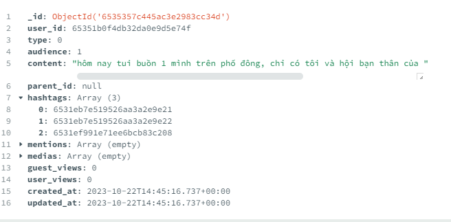
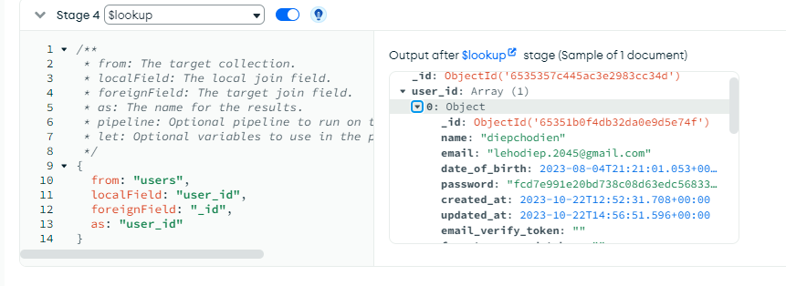
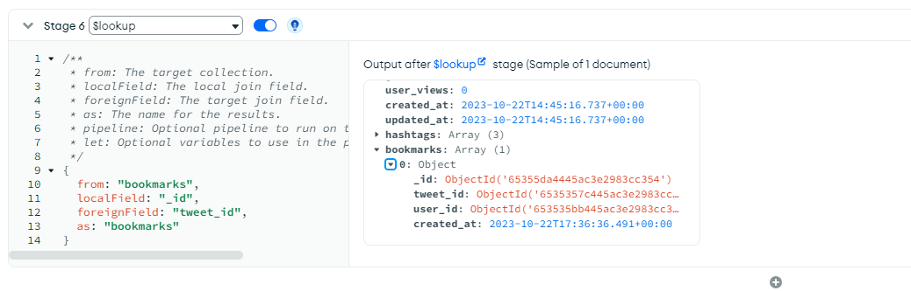
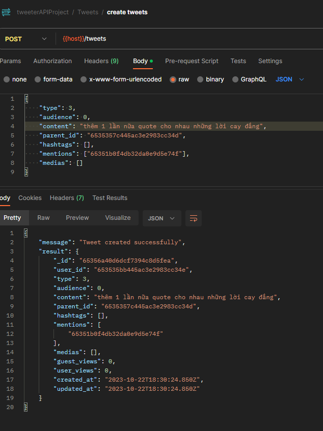
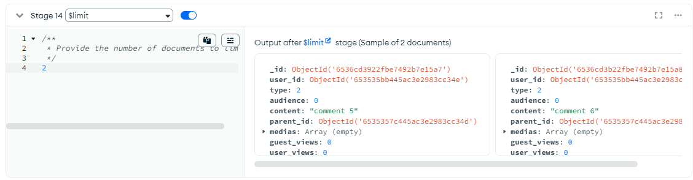

# I - chức năng get Tweet detail

### 1 - phân tích chức năng audience của tweet

- phân tích về `tweet`:

  - 1 `tweet` sẽ có 1 trong 2 trạng thái `audience` là : `Everyone 0` hoặc `TwitterCircle 1`
  - `TwitterCircle` giống như hội bạn thân của 1 `user`: chứa khoảng 150 người
  - khi `tweet` có `audience` là `TwitterCircle` thì chỉ những ai mà `user` đó thêm vào `TwitterCircle` mới có thể xem được `tweet` đó
  - **vì TwitterCircle chỉ chứa 150 người là tối đa, đây không phải là 1 con số lớn, nên mình hoàn toàn có thể nhúng vào user**

- vào `User.schema.ts` và thêm `TwitterCircle` vào `User`:

  ```ts
    interface UserType {
        ...
        twitter_circle?: ObjectId[]//thêm
        ...
    }

    export default class User {
        ...
        twitter_circle?: ObjectId[]//thêm
        ...
        constructor(user: UserType) {
            ...
            this.twitter_circle = user.twitter_circle || []//thêm
            ...
        }
    }
  ```

- và ta cũng phải chỉnh lại validation cho collections `users` trong `mongodb`
  
  
  nhớ bấm nút `update` để lưu lại trên `mongodb`

- test lại code và dùng user khác

  - đăng ký
    
  - lấy email_verify_token ở terminal để xác nhận email
    
  - login bằng acc mới
    
  - acc mới này có `twitter_circle` là `[]` vì chưa thêm ai vào
    

### 2 - tiến hành làm routes để lấy tweet detail

- 1 bài `tweet` nếu có `audience` là `everyone` thì ai cũng có thể xem đc, kể cả chưa đăng nhập
- 1 bài `tweet` nếu có `audience` là `TwitterCircle` thì chỉ những ai mà `user` đó thêm vào `TwitterCircle` mới có thể xem được `tweet` đó
- vậy nếu muốn xem 1 bài `tweet` có `audience` là `TwitterCircle` thì: `user` đó phải `đăng nhập` và gữi `access_token` để `server` biết là user đó có nằm trong `TwitterCircle` của `user` đăng bài hay không
- trong `tweets.routes.ts` tạo route `GET /:tweets_id` để lấy tweet detail

  ```ts
  /*
    des: get tweets detail
    path: / nghĩa là localhost:4000/tweets thôi
    headers: {Authorization?: Bearer <access_token>}
    method: get
    */

  tweetsRouter.get(
    '/:tweet_id',
    tweetIdValidator,
    isUserLoggedInValidator(accessTokenValidator),
    isUserLoggedInValidator(verifiedUserValidator),
    audienceValidator,
    wrapAsync(getTweetController)
  )
  //isUserLoggedInValidator là middleware kiểm tra xem người dùng đã đăng nhập chưa
  //nếu chưa thì chỉ xem đc các tweet everyone
  //nếu rồi thì middleware sẽ dùng lại accessTokenValidator, verifiedUserValidator từ đó biết
  //user này có được phép xem tweet này hay không

  //audienceValidator kiểm tra đối tượng có được phép xem tweet này hay không sau khi đã xác định ở bước trên
  ```

- vào `users.middlewares.ts` tạo `isUserLoggedInValidator`

  - trước tiên mình giới thiệu về `req.header` và `req.headers`
    - **`req.header` là của chung hệ thống `backend`** nếu dùng `req.header('authorization')` hay dùng `req.header('Authorization')` thì sẽ lấy được `bearer access_token`
    - **`req.headers` là của riêng `js`** dựa trên core là `req.header`, lúc xài sẽ là `req.headers.authorization` để có được `bearer access_token`, còn dùng `req.headers.Authorization` thì k đc
    - vậy tóm lại là `req.header` thì hoa thường thoải mái, còn `req.headers` thì phải viết thường
  - tiến hành tạo `isUserLoggedInValidator`

    ```ts
    //hàm nhận vào 1 middleware return void và trả ra 1 middleware
    export const isUserLoggedInValidator =
      (middleware: (req: Request, res: Response, next: NextFunction) => void) =>
      (req: Request, res: Response, next: NextFunction) => {
        //nếu có truyền lên authorization thì mới dùng middleware
        if (req.headers.authorization) {
          return middleware(req, res, next)
        }
        //không thì mình sẽ next
        next()
      }
    ```

- vào `tweets.middlwares.ts` làm `audienceValidator`: kiểm tra xem đối tượng gữi req có được xem tweet hay không

  - ta để ý rằng trước khi vào `audienceValidator` thì đã vào `tweetIdValidator` để kiểm tra bài viết có tồn tại hay không ? , trong đó ta đã query ra `tweet` rồi, nhưng chưa lưu lại để dùng trong `audienceValidator` sắp tới, nên giờ ta sẽ tiền hành lưu

    ```ts
    export const tweetIdValidator = validate(
        checkSchema({
        tweet_id: {
            custom: {
            options: async (value, { req }) => {//vì req này k phải được express định nghĩa nên
                ...
                ;(req as Request).tweet = tweet //lưu lại tweet vào req, nhưng nó sẽ là any, ta sẽ định nghĩa lại
                return true
            }
            }
        }
        })
    )
    ```

  - vào `type.d.ts` định nghĩa lại

    ```ts
        declare module 'express' {
            interface Request {
                ...
                tweet?: Tweet //thêm
            }
        }

    ```

  - tạo `audienceValidator`

    ```ts
    //vì hàm này mình truy cập vào database nên sẽ dùng async await, nếu phát sinh lỗi phải dùng try catch
    //nếu không thích dùng trycatch có thể bọc cả hàm vào wrapAsync
    export const audienceValidator = wrapAsync(async (req: Request, res: Response, next: NextFunction) => {
      const tweet = req.tweet as Tweet
      //nếu bài tweet này là TwitterCircle thì mới hiểm tra user có đc xem hay k, còn là everyone thì k cần
      if (tweet.audience == TweetAudience.TwitterCircle) {
        //kiểm tra người xem tweet này đã đăng nhập chưa
        //nếu chưa đăng nhập thì sẽ không có req.decoded_authorization
        if (!req.decoded_authorization) {
          throw new ErrorWithStatus({
            status: HTTP_STATUS.UNAUTHORIZED, //401
            message: USERS_MESSAGES.ACCESS_TOKEN_IS_REQUIRED //thêm trong messages.ts
          })
        }
        //lấy user_id của người xem tweet này
        const { user_id } = req.decoded_authorization as TokenPayload
        //kiểm tra xem người đăng tweet có bị banned không?
        const authorUser = await databaseService.users.findOne({
          _id: new ObjectId(tweet.user_id) //user_id này là của tweet, tức là của tác giả bài đăng
        })
        //nếu không có authorUser hoặc authorUser bị banned thì res 404
        //thì ta sẽ báo rằng bài đăng này không tồn tại nữa và không cho xem
        if (!authorUser || authorUser.verify == UserVerifyStatus.Banned) {
          throw new ErrorWithStatus({
            status: HTTP_STATUS.NOT_FOUND, //404
            message: TWEETS_MESSAGES.TWEET_NOT_FOUND //thêm trong messages.ts
          })
        }
        //kiểm tra xem user có nằm trong twitter_circle của authorUser hay không
        const isInTwitterCircle = authorUser.twitter_circle.some((user_circle_id) => user_circle_id.equals(user_id)) //equals là method có sẵn của object
        //nếu không nằm trong twitter_circle của authorUser và không phải tác giả
        if (!isInTwitterCircle && !authorUser._id.equals(user_id)) {
          //ném res 403
          throw new ErrorWithStatus({
            status: HTTP_STATUS.FORBIDDEN, //403
            message: TWEETS_MESSAGES.TWEET_IS_NOT_PUBLIC //thêm trong messages.ts
          })
        }
      }
      next()
    })
    ```

- test thử
  - dùng `lehodiep.2045@gmail.com` tạo `tweet` có `audience` là `TwitterCircle`
    
  - tạo 1 account nữa là `lehodiep.2050@gmail.com`, verify email và đăng nhập luôn
    
  - vào mongodb cập nhật `twitter_circle` của `lehodiep.2045@gmail.com` thêm `user_id` của `lehodiep.2050@gmail.com`
    ```ts
    db.users.updateOne({ _id: ObjectId('65351b0f4db32da0e9d5e74f') }, [
      {
        $set: {
          twitter_circle: [ObjectId('653535bb445ac3e2983cc34e')],
          updated_at: '$$NOW'
        }
      }
    ])
    ```
    - 
  - dùng `lehodiep.2045@gmail.com` truy cập vào bài đăng mới
    
  - thử k truyền lên access_token giống như chưa đăng nhập xem
    

# II - tìm hiều về MongoDB Aggregation Pipeline

## 1 - \$match và $lookup

- giống như trong 1 câu query ta có thể chia thành nhiều công đoạn
- query được kết quả, rồi dùng kết quả đó query tiếp
- lấy cụ thể như bài `tweet` này
  
  ta muốn hashtag phải hiển thị cụ thể object hashtag luôn thay vì chỉ là id của hashtag
- ta làm như sau, đầu tiên ta có giai đoạn match: giai đoạn tìm đối tượng thỏa yêu cầu
  
- thêm giải đoạn 2 : ta chọn $lookup để join 2 bản và tạo ra property mới tên `result` lưu mảng các object hashtags tương ứng
  
- ta đổi as thành `hashtags` để dễ ghi đè lên luôn
  

## 2 - \$project \$addFields $map

- thêm stage \$project giống select bên sql, loại bỏ những prop mà ta không muốn hiển thị
  
  như này thì kết quả trả ra không được có `mention`, nếu muốn chỉ hiển thị `mentions` và \_id thôi thì để `mentions`: 1 còn id thì tự có
  **không được để 2 prop vừa có 1 vừa có 0 được**
- giả xử ta `$lookup` `user_id` để lấy thông tin người đăng
  
- sau đó ta không muốn hiển thị password của user_id thì ta phải dùng `$map`
- `$map` là 1 `Aggregation Pipeline operators` có cấu trúc xài như sau
  
  cũng giống như js `map` dùng để biến đổi các item trong mảng theo 1 công thức
- tạo stage cho `map` và dùng $addFields để thêm 1 prop mới là `user` lưu thông tin của người đăng
  
- sau cùng ta save lại
  

## 3 - \$size và \$array

- ta có thể biết được bao nhiêu người đã bình luận, bao nhiều người đã share đã xem `tweet`, đã like, đã bookmark
- tạo bookmark cho bài viết gần nhất
  
- đầu tiên ta nối `tweets` với `bookmarks` bằng lookup
  
- dùng `$size` để lấy kích thước của mảng, giống như đếm
  
- ta làm tương tự với like
  
- nhớ `save`

## 4 - \$filter và $eq

- ta sẽ đếm số lượng retweet và quote , comment của 1 bài `tweet`
- bản chất đó cũng chỉ là các tweet con của tweet cha mà thôi
- tạo 1 bài `retweet`, 1 bài `comment`, 1 `quote` dựa trên bài `tweet` gần nhất
  - `lehodiep.2050` `retweet` bài của `lehodiep.2045`, và retweet nên content là rỗng, và type: 1
    
  - `lehodiep.2050` `comment` bài của `lehodiep.2045`
    
  - `lehodiep.2050` `quote` bài của `lehodiep.2045`
    
- tạo stage liên kết các bài viết liên quan đến bài viết gốc
  
- từ `tweet_children` lọc và đếm ra các retweet comment quote
  
- thêm thử 1 quote thứ 2 xem sao
  
- đã tăng
  
- ngoài ra ta còn có thể tính total view của bài viết
  
- thêm stage loại bỏ `tweet_children` để tránh bị rối
  

- thật tế mình không cần thông tin của user_id trong bài post mà mình cần `mentions`, nên ta sẽ fix lại stage 3, 4 , 5
  
  
  

- sau đó nhớ lưu lại

- vậy sau cùng ta sẽ có kết quả gần giống thế này
  

## 5 - kết nối với dự án của ta

- chọn export to language
  
- bảng bên phải chọn node và copy
  
- ta sẽ bỏ vào `tweets.middlwares.ts` chỗ `tweetIdValidator`, đoạn tìm kiếm tweet

  ```ts
  export const tweetIdValidator = validate(
  checkSchema({
      tweet_id: {
      custom: {
          options: async (value, { req }) => {
              ...
              //nếu tweet_id không tồn tại thì báo lỗi
              // const tweet = await databaseService.tweets.findOne({
              //   _id: new ObjectId(value)
              // })

              //dùng phân dã để lấy phần tử đầu tiên trong mảng trả về của .aggregate
              const [tweet] = await databaseService.tweets.aggregate<Tweet>(
              //bỏ vô đây đoạn đã copy được từ mongoDB nhưng trong đó fix
              {
                  $match: {
                      _id: new ObjectId(value)
                  }
              },

              ...
              {
                  $addFields: {
                    retweet_count: {
                      $size: {
                        $filter: {
                          input: '$tweet_children',
                          as: 'item',
                          cond: {
                            $eq: ['$$item.type', TweetType.Retweet] //1 fix chỗ này
                          }
                        }
                      }
                    },
                    comment_count: {
                      $size: {
                        $filter: {
                          input: '$tweet_children',
                          as: 'item',
                          cond: {
                            $eq: ['$$item.type', TweetType.Comment] //2 fix chỗ này
                          }
                        }
                      }
                    },
                    quote_count: {
                      $size: {
                        $filter: {
                          input: '$tweet_children',
                          as: 'item',
                          cond: {
                            $eq: ['$$item.type', TweetType.QuoteTweet] //3 fix chỗ này
                          }
                        }
                      }
                    },
                    view: {
                      $add: ['$user_views', '$guest_views']
                    }
                  }
                },
                ...
            ).toArray()//dừng quên .toArray
          }
        }
      }
   })
  )
  ```

- fix nốt `getTweetController`

  ```ts
  export const getTweetController = async (req: Request<ParamsDictionary, any, any>, res: Response) => {
    res.json({
      message: TWEETS_MESSAGES.GET_TWEET_SUCCESS,
      result: req.tweet
    })
  }
  ```

- test lại get tweet detail
  

# III - tăng view cho mỗi lần get tweet detail

- 1 `tweet` có 2 thành phần view đó là `guest_view` và `user_view`
- mỗi lần người dùng get tweet detail thì ta sẽ tăng view lên 1
- việc tăng lượt view sẽ cần truy cập vào `database` nên ta sẽ vào `tweets.services.ts` tạo method `increaseView`
  ```ts
  async increaseView(tweet_id: string, user_id?: string) {
    const inc = user_id ? { user_views: 1 } : { guest_views: 1 }
    const result = await databaseService.tweets.findOneAndUpdate(
      { _id: new ObjectId(tweet_id) },
      {
        $inc: inc,
        $currentDate: { updated_at: true }
      },
      {
        returnDocument: 'after',
        projection: {
          guest_views: 1,
          user_views: 1,
          updated_at: 1
        }
      }
    )
    //kết quả trả về là object có 2 thuộc tính guest_views và user_views kèm theo _id
    return result.value as WithId<{
      guest_views: number
      user_views: number
      updated_at: Date
    }>
  }
  ```
- xài ở `getTweetController`

  ```ts
  export const getTweetController = async (req: Request<ParamsDictionary, any, any>, res: Response) => {
    const result = await tweetsService.increaseView(req.params.tweet_id, req.decoded_authorization?.user_id) //có thì truyền giá trị, k có thì truyền undefined
    //req.tweet là lấy trước khi tăng view, còn result là số view sau khi tăng  view, nên ta sẽ kết hợp lại
    const tweet = {
      ...req.tweet,
      guest_views: result.guest_views,
      user_views: result.user_views,
      updated_at: result.updated_at
    }
    res.json({
      message: TWEETS_MESSAGES.GET_TWEET_SUCCESS,
      result: tweet
    })
  }
  ```

- test lại get view xem có tăng view không ?
  

# IV - Get comment, retweet, quote với phân trang

- mình tách riêng Get comment, retweet, quote vì nếu 1 bài `tweet` của 1 người nổi tiếng thì chắc chắn sẽ có rất nhiều comment, retweet, quote và nó sẽ làm mình query đc 1 object rất rất là nặng và lâu

- ngoài ra chúng ta sẽ `phân trang`, để khi chúng ta load thì nó chỉ load 10 bài `tweet` chúng ta `scroll tiếp` thì nó `load tiếp`, đó gọi là `infinite scroll`, vì thật ra đó chỉ là kỹ thuật phân trang bth, nhưng đã ẩn đi `pagination`

- để tìm `comment` của 1 bài `tweet A` thì ta cần tìm những `tweet` có:

  - `parent_id` là `_id của tweet A`
  - `type` = 2 là `TweetType.Comment`

- tạo 10 bài comment của 1 `tweet`, có conent "comment 1->10"
  
- giờ ta sẽ lấy các bài comment với `mongoDB`
  
- giờ ta sẽ sao tạo ra 1 aggregations dựa trên `getTweetDetail`
  
- fix lại stage 1 theo nhu cầu tìm kiếm dựa trên parent_id và type
  
- thêm stage \$skip và run thử
  
  **và sau đó ta sẽ thấy nó bỏ qua 5 thằng comment đầu tiên và kết quả là những thằng comment còn lại, đó là skip**
- bấm edit và thêm stage \$limit, giới hạn số lượng trả về
  
  ta thấy kết quả chỉ trả ra 5 6 vì nó giới hạn là 2 mà thôi
- giờ ta lưu lại
  **trong thực tế skip phải ở trước limit**

## 1 -tạo route get tweet children

- tạo route cho `Get Tweet Children`

  ```ts
  /*
  des: get tweets children
  path: /:tweet_id/children 
  method: get
  headers: {Authorization?: Bearer <access_token>} nếu k có thì k xem đc 1 vài tweet
  query: {limit: number, page: number, tweet_type: TweetType}
  */
  tweetsRouter.get(
    '/:tweet_id/children',
    tweetIdValidator,
    isUserLoggedInValidator(accessTokenValidator),
    isUserLoggedInValidator(verifiedUserValidator),
    audienceValidator,
    wrapAsync(getTweetChildrenController)
  )
  ```

- vào `tweets.services.ts` tạo `getTweetChildren`: để get các tweet con của 1 tweet cha
  lấy code từ mongoDB và sử dụng
  
  và sử dụng trong hàm mới `getTweetChildren`

  ```ts
  async getTweetChildren({
      tweet_id,
      limit,
      page,
      tweet_type
      user_id//thêm cái này để tý mình tăng view
    }: {
      tweet_id: string
      limit: number
      page: number
      tweet_type: TweetType
      user_id?: string //nếu k đăng nhập thì k có nên nó optional
    }) {
      const tweets = await databaseService.tweets
        .aggregate<Tweet>(
          //bỏ vào công thức trên mongodb.com
          [
            {
              $match: {
                parent_id: new ObjectId(tweet_id), //chỗ này là tweet_id của tweet cha
                type: tweet_type //chỗ này là tweet_type của tweet con: comment|retweet|quote
              }
            },
            ...
            {
              $addFields: {
                retweet_count: {
                  $size: {
                    $filter: {
                      input: '$tweet_children',
                      as: 'item',
                      cond: {
                        $eq: ['$$item.type', TweetType.Retweet] //1
                      }
                    }
                  }
                },
                comment_count: {
                  $size: {
                    $filter: {
                      input: '$tweet_children',
                      as: 'item',
                      cond: {
                        $eq: ['$$item.type', TweetType.Comment] //2
                      }
                    }
                  }
                },
                quote_count: {
                  $size: {
                    $filter: {
                      input: '$tweet_children',
                      as: 'item',
                      cond: {
                        $eq: ['$$item.type', TweetType.QuoteTweet] //3
                      }
                    }
                  }
                },
                ...
          ]
        )
        .toArray() //dừng quên .toArray
      //lấy số lượng các doc tìm đc
      const total = await databaseService.tweets.countDocuments({
        parent_id: new ObjectId(tweet_id),
        type: tweet_type
      })
      return { tweets, total }
    }
  ```

- trong `tweets.controllers.ts` tạo controller `getTweetChildrenController` và sử dụng `getTweetChildren`

  ```ts
  export const getTweetChildrenController = async (req: Request<ParamsDictionary, any, any>, res: Response) => {
    const { tweet_id } = req.params
    const limit = Number(req.query.limit) //vì truyền lên là string nên phải ép về number
    const page = Number(req.query.page)
    const tweet_type = Number(req.query.tweet_type) as TweetType
    const { user_id } = req.decoded_authorization as TokenPayload
    const { total, tweets } = await tweetsService.getTweetChildren({
      tweet_id,
      limit,
      page,
      tweet_type
      user_id: user_id.toString()
    })
    res.json({
      message: TWEETS_MESSAGES.GET_TWEET_CHILDREN_SUCCESS,
      result: {
        tweets,
        tweet_type,
        limit,
        page,
        total_page: Math.ceil(total / limit) //làm tròn(tổng item / số item mỗi trang)
      }
    })
  }
  ```

- test thử : vì mình có 12 comment nên nếu mỗi lần lấy 2 thì chia đc 6 trang
  

## 2 - tăng view cho các tweet con đã lấy đc

- vậy trong `getTweetChildren` sau khi lấy đc các `tweet` con ra thì ta sẽ tiến hành dùng `.map()` để cập nhật
  tăng vew cho từng `tweet con đã lấy ra`

  ```ts
    async getTweetChildren({
      tweet_id,
      limit,
      page,
      tweet_type,
      user_id
    }: {
      tweet_id: string
      limit: number
      page: number
      tweet_type: TweetType
      user_id?: string
    }) {
      const tweets = await databaseService.tweets
        .aggregate<Tweet>(
          //bỏ vào công thức trên mongodb.com
        )
        .toArray()

      //bây giờ ta sẽ tăng view cho các tweet con đã tìm đc
      //lấy danh sách id các tweet con
      const ids = tweets.map((tweet) => tweet._id as ObjectId)
      //tăng view cho các tweet con ở database
      const inc = user_id ? { user_views: 1 } : { guest_views: 1 }
      const date = new Date()
      await databaseService.tweets.updateMany(
        {
          _id: {
            $in: ids
          }
        },
        {
          $inc: inc,
          //muốn cập nhật thời gian ta k dùng currentdate trong updateMany được vì nó sẽ k return về document
          //khiến ta không thu được updated_at để gữi cho client
          $set: {
            updated_at: date //thời gian chậm hơn tý xíu so với server
          }
        }
      )

      //vì updateMany không return các doc đã cập nhật nên ta không thể gữi kết quả sau cập nhật cho người dùng
      //chúng ta đành phải cập nhật 'tweets'
      //'tweets' là mảng các tweet con đã tìm đc trước khi update view nên nó sẽ chưa tăng view và chưa cập nhật updated_at
      //ta sẽ cập nhật lại
      tweets.forEach((tweet) => {
        tweet.updated_at = date
        user_id ? (tweet.user_views += 1) : (tweet.guest_views += 1)
      })

      //lấy số lượng các doc tìm đc
      const total = await databaseService.tweets.countDocuments({
        parent_id: new ObjectId(tweet_id),
        type: tweet_type
      })
      return { tweets, total }
    }
  }
  ```

- ở đây ta thấy việc tăng view các tweet con ở database và việc countDocuments là độc lập, nên ta sẽ dùng Promise all để gộp chúng lại chạy song song tiết kiệm thời gian

  ```ts
  async getTweetChildren({
      tweet_id,
      limit,
      page,
      tweet_type,
      user_id
    }: {
      tweet_id: string
      limit: number
      page: number
      tweet_type: TweetType
      user_id?: string
    }) {
      const tweets = await databaseService.tweets
        .aggregate<Tweet>(
          //bỏ vào công thức trên mongodb.com
        ).toArray()

        const ids = tweets.map((tweet) => tweet._id as ObjectId)
        const inc = user_id ? { user_views: 1 } : { guest_views: 1 }
        const date = new Date()

        //lấy total ở vị trí thứ 2
        const [, total] = await Promise.all([
          databaseService.tweets.updateMany(
            {
              _id: {
                $in: ids
              }
            },
            {
              $inc: inc,
              $set: {
                updated_at: date
              }
            }
          ),
          databaseService.tweets.countDocuments({
            parent_id: new ObjectId(tweet_id),
            type: tweet_type
          })
        ])

        //vì updateMany không return các doc đã cập nhật nên ta không thể gữi kết quả sau cập nhật cho người dùng
        //chúng ta đành phải cập nhật 'tweets'
        //'tweets' là mảng các tweet con đã tìm đc trước khi update view nên nó sẽ chưa tăng view và chưa cập nhật updated_at
        //ta sẽ cập nhật lại
        tweets.forEach((tweet) => {
          tweet.updated_at = date
          user_id ? (tweet.user_views += 1) : (tweet.guest_views += 1)
        })
        return { tweets, total }
      }
  ```

- test lại để xem view và updated_at đã được cập nhật chưa, qua page nào thì những tweet ở đó mới đc tăng view
  

## 3 - getTweetChildrenValidator

- chỉnh lại route `get tweet children` và thêm middleware `getTweetChildrenValidator`

  ```ts
  tweetsRouter.get(
    '/:tweet_id/children',
    tweetIdValidator,
    getTweetChildrenValidator, // thêm ở đây
    isUserLoggedInValidator(accessTokenValidator),
    isUserLoggedInValidator(verifiedUserValidator),
    audienceValidator,
    wrapAsync(getTweetChildrenController)
  )
  ```

- làm middleware `getTweetChildrenValidator`

  ```ts
  export const getTweetChildrenValidator = validate(
    checkSchema(
      {
        tweet_type: {
          isIn: {
            options: [tweetTypes],
            errorMessage: TWEETS_MESSAGES.INVALID_TYPE
          }
        },
        limit: {
          isNumeric: true,
          custom: {
            options: (value, { req }) => {
              const num = Number(value)
              if (num > 100 || num < 1) {
                throw new Error(TWEETS_MESSAGES.LIMIT_MUST_BE_LESS_THAN_100)
              }
              return true
            }
          }
        },
        page: {
          isNumeric: true,
          custom: {
            options: (value, { req }) => {
              const num = Number(value)
              if (num < 1) {
                throw new Error(TWEETS_MESSAGES.LIMIT_MUST_BE_GEATER_THAN_0)
              }
              return true
            }
          }
        }
      },
      ['query']
    )
  )
  ```

- vào `Tweet.requests.ts` định nghĩa `params` và `query` cho `req` của route `get tweet children`

  ```ts
  export interface TweetParam extends ParamsDictionary {
    tweet_id: string
  }

  export interface TweetQuery extends Query {
    limit: string
    page: string
    tweet_type: string
  }
  ```

- ta sẽ dùng 2 interface này để định nghĩa cho `params` và `query`

  ```ts
    export const getTweetChildrenController = async (req: Request<TweetParam, any, any, TweetQuery>, res: Response) => {...}
  ```

- **khi xong thì ta sẽ thấy `route` báo lỗi thế này**
  
  lỗi này phát sinh do `wrapAsync` đang dùng giá trị định nghĩa request mặc định, ta để any là xong
  ```ts
  export const wrapAsync =
  <P>(func: RequestHandler<P, any, any, any>) =>
  ```
- test lại bằng cách truyền sai đủ kiểu
  

# V - tạo ra dữ liệu giả với faker-js/faker

- ta có thể dùng thư viện [faker-js](https://www.npmjs.com/package/@faker-js/faker) để tạo ra dữ liệu giả
- cài đặt `faker-js`

  ```bash
  npm i @faker-js/faker -D
  ```

- trong folder `utils` tạo file `fake.ts` chứa hàm tiện ích giúp ta tạo ra data fake, copy đoạn code sau bỏ vào và đọc

  ```ts
  import { faker } from '@faker-js/faker'
  import { ObjectId, WithId } from 'mongodb'
  import { MediaType, TweetAudience, TweetType, UserVerifyStatus } from '~/constants/enums'
  import { TweetRequestBody } from '~/models/requests/Tweet.requests'
  import { RegisterReqBody } from '~/models/requests/User.requests'
  import { Follower } from '~/models/schemas/Followers.schema'
  import Hashtag from '~/models/schemas/Hashtag.schema'
  import Tweet from '~/models/schemas/Tweet.schema'
  import User from '~/models/schemas/User.schema'
  import databaseService from '~/services/database.services'
  import { hashPassword } from '~/utils/crypto'

  /**
   * Yêu cầu: Mọi người phải cài đặt `@faker-js/faker` vào project
   * Cài đặt: `npm i @faker-js/faker`
   */

  // Mật khẩu cho các fake user
  const PASSWORD = '!Diep12345'
  // ID của tài khoản của mình, dùng để follow người khác: ở đây mình dùng lehodiep.2045
  const MYID = new ObjectId('65351b0f4db32da0e9d5e74f')

  // Số lượng user được tạo, mỗi user sẽ mặc định tweet 2 cái
  const USER_COUNT = 100

  //hàm tạo ngẫu nhiên user
  const createRandomUser = () => {
    const user: RegisterReqBody = {
      name: faker.internet.displayName(),
      email: faker.internet.email(),
      password: PASSWORD,
      confirm_password: PASSWORD,
      date_of_birth: faker.date.past().toISOString()
    }
    return user
  }

  //hàm tạo ngẫu nhiên tweet
  const createRandomTweet = () => {
    const tweet: TweetRequestBody = {
      type: TweetType.Tweet,
      audience: TweetAudience.Everyone,
      content: faker.lorem.paragraph({
        min: 10,
        max: 160
      }),
      hashtags: ['NodeJS', 'MongoDB', 'ExpressJS', 'Swagger', 'Docker', 'Socket.io'],
      medias: [
        {
          type: MediaType.Image,
          url: faker.image.url()
        }
      ],
      mentions: [],
      parent_id: null
    }
    return tweet
  }

  //hàm tạo ra mảng 100 user
  const users: RegisterReqBody[] = faker.helpers.multiple(createRandomUser, {
    count: USER_COUNT
  })

  //hàm insert 100 user vào database
  const insertMultipleUsers = async (users: RegisterReqBody[]) => {
    console.log('Creating users...')
    const result = await Promise.all(
      users.map(async (user) => {
        const user_id = new ObjectId()
        await databaseService.users.insertOne(
          new User({
            ...user,
            _id: user_id,
            username: `user${user_id.toString()}`,
            password: hashPassword(user.password),
            date_of_birth: new Date(user.date_of_birth),
            verify: UserVerifyStatus.Verified
          })
        )
        return user_id
      })
    )
    console.log(`Created ${result.length} users`)
    return result
  }

  //hàm giúp lehodiep.2045 follow 100 user
  const followMultipleUsers = async (user_id: ObjectId, followed_user_ids: ObjectId[]) => {
    console.log('Start following...')
    const result = await Promise.all(
      followed_user_ids.map((followed_user_id) =>
        databaseService.followers.insertOne(
          new Follower({
            user_id,
            followed_user_id: new ObjectId(followed_user_id)
          })
        )
      )
    )
    console.log(`Followed ${result.length} users`)
  }

  const checkAndCreateHashtags = async (hashtags: string[]) => {
    const hashtagDocuemts = await Promise.all(
      hashtags.map((hashtag) => {
        // Tìm hashtag trong database, nếu có thì lấy, không thì tạo mới
        return databaseService.hashtags.findOneAndUpdate(
          { name: hashtag },
          {
            $setOnInsert: new Hashtag({ name: hashtag })
          },
          {
            upsert: true,
            returnDocument: 'after'
          }
        )
      })
    )
    return hashtagDocuemts.map((hashtag) => (hashtag.value as WithId<Hashtag>)._id)
  }

  //hàm insert 1 tweet vào database
  const insertTweet = async (user_id: ObjectId, body: TweetRequestBody) => {
    const hashtags = await checkAndCreateHashtags(body.hashtags)
    const result = await databaseService.tweets.insertOne(
      new Tweet({
        audience: body.audience,
        content: body.content,
        hashtags,
        mentions: body.mentions,
        medias: body.medias,
        parent_id: body.parent_id,
        type: body.type,
        user_id: new ObjectId(user_id)
      })
    )
    return result
  }

  //hàm tạo 2 tweet cho mỗi user| tức là tổng tạo đc 100*2 tweet
  const insertMultipleTweets = async (ids: ObjectId[]) => {
    console.log('Creating tweets...')
    console.log(`Counting...`)
    let count = 0
    const result = await Promise.all(
      ids.map(async (id, index) => {
        await Promise.all([insertTweet(id, createRandomTweet()), insertTweet(id, createRandomTweet())])
        count += 2
        console.log(`Created ${count} tweets`)
      })
    )
    return result
  }

  //chỗ chạy code, đầu tiên ta sẽ tạo 100 user, sau đó follow 100 user, sau đó tạo 200 tweet
  insertMultipleUsers(users).then((ids) => {
    followMultipleUsers(new ObjectId(MYID), ids).catch((err) => {
      console.error('Error when following users')
      console.log(err)
    })
    insertMultipleTweets(ids).catch((err) => {
      console.error('Error when creating tweets')
      console.log(err)
    })
  })
  ```

- vào `index.ts` import như sau là nó sẽ chạy

```ts
import '~/utils/fake'
```

- **thấy terminal như vậy là xong , ta sẽ tắt terminal và xóa `import '~/utils/fake'` để nó k tạo thêm**
  
  
  

# VI - Aggregation cho new feed

- `new feed` sẽ là lấy các `tweet của những người mà mình follow` + `tweet của chính mình`
- và các tweet này sẽ được sắp xếp theo thời gian, mới nhất thì ở đầu, cũ nhất thì ở cuối kèm theo phân trang

- trong ví dụ này mình đang đóng vai là `user lehodiep.2045` nên mình có `user_id là : 65351b0f4db32da0e9d5e74f`
- trong mongodb vào `followers` tìm những người mà `lehodiep.2045` follow
  
- vào `tweets` tạo `aggregation` để lấy ra những tweet của những người mà `lehodiep.2045` follow
- vào mục `</> TEXT` bỏ đoạn code dưới đây vào

  ```js
  ;[
    {
      $match:
        /**
    tìm bài tweet nào có user_id nằm trong mảng các user_id
    mà mình đã follow
    */
        {
          user_id: {
            $in: [
              ObjectId('65351b0f4db32da0e9d5e74f'),
              //chính mình
              ObjectId('65381c61b270f4a7fc2fc336')
              //còn nhiều nữa, tý mình sẽ thay thế bằng mảng
            ]
          }
        }
    },
    {
      $lookup: {
        from: 'users',
        localField: 'user_id',
        foreignField: '_id',
        as: 'user'
      }
    },
    {
      $match:
        /**
    lấy ra các bài tweet
    hoặc là audience: Everyone
    hoặc là audience: tweet-circle && người đăng.tweet-circle có chứa user_id của mình
    */
        {
          $or: [
            {
              audience: 0
            },
            {
              $and: [
                {
                  audience: 1
                },
                {
                  'user.tweeter_circle': {
                    $in: [ObjectId('65351b0f4db32da0e9d5e74f')]
                  }
                }
              ]
            }
          ]
        }
    },
    {
      $skip:
        /**
         * Provide the number of documents to skip.
         */
        0
    },
    {
      $limit:
        /**
         * Provide the number of documents to limit.
         */
        2
    },
    {
      $unwind:
        /**
    tweet có property user là array chứa 1 obj, ta muốn nó chỉ là obj thôi
    */
        {
          path: '$user'
        }
    },
    {
      $lookup:
        /**
         * from: The target collection.
         * localField: The local join field.
         * foreignField: The target join field.
         * as: The name for the results.
         * pipeline: Optional pipeline to run on the foreign collection.
         * let: Optional variables to use in the pipeline field stages.
         */
        {
          from: 'hashtags',
          localField: 'hashtags',
          foreignField: '_id',
          as: 'hashtags'
        }
    },
    // {
    //   $project:
    //     /**
    //      * specifications: The fields to
    //      *   include or exclude.
    //      */
    //     {
    //       mentions: 0,
    //     },
    // }
    {
      $lookup:
        /**
         * from: The target collection.
         * localField: The local join field.
         * foreignField: The target join field.
         * as: The name for the results.
         * pipeline: Optional pipeline to run on the foreign collection.
         * let: Optional variables to use in the pipeline field stages.
         */
        {
          from: 'users',
          localField: 'mentions',
          foreignField: '_id',
          as: 'mentions'
        }
    },
    {
      $addFields:
        /**
         * specifications: The fields to
         *   include or exclude.
         */
        {
          mentions: {
            $map: {
              input: '$mentions',
              as: 'mentions',
              in: {
                _id: '$$mentions._id',
                name: '$$mentions.name',
                username: '$$mentions.username',
                email: '$$mentions.email'
              }
            }
          }
        }
    },
    {
      $lookup:
        /**
         * from: The target collection.
         * localField: The local join field.
         * foreignField: The target join field.
         * as: The name for the results.
         * pipeline: Optional pipeline to run on the foreign collection.
         * let: Optional variables to use in the pipeline field stages.
         */
        {
          from: 'bookmarks',
          localField: '_id',
          foreignField: 'tweet_id',
          as: 'bookmarks'
        }
    },
    {
      $addFields:
        /**
         * newField: The new field name.
         * expression: The new field expression.
         */
        {
          bookmarks: {
            $size: '$bookmarks'
          }
        }
    },
    {
      $lookup:
        /**
         * from: The target collection.
         * localField: The local join field.
         * foreignField: The target join field.
         * as: The name for the results.
         * pipeline: Optional pipeline to run on the foreign collection.
         * let: Optional variables to use in the pipeline field stages.
         */
        {
          from: 'likes',
          localField: '_id',
          foreignField: 'tweet_id',
          as: 'likes'
        }
    },
    {
      $addFields:
        /**
         * newField: The new field name.
         * expression: The new field expression.
         */
        {
          likes: {
            $size: '$likes'
          }
        }
    },
    {
      $lookup:
        /**
         * from: The target collection.
         * localField: The local join field.
         * foreignField: The target join field.
         * as: The name for the results.
         * pipeline: Optional pipeline to run on the foreign collection.
         * let: Optional variables to use in the pipeline field stages.
         */
        {
          from: 'tweets',
          localField: '_id',
          foreignField: 'parent_id',
          as: 'tweet_children'
        }
    },
    {
      $addFields:
        /**
         * newField: The new field name.
         * expression: The new field expression.
         */
        {
          retweet_count: {
            $size: {
              $filter: {
                input: '$tweet_children',
                as: 'item',
                cond: {
                  $eq: ['$$item.type', 1]
                }
              }
            }
          },
          comment_count: {
            $size: {
              $filter: {
                input: '$tweet_children',
                as: 'item',
                cond: {
                  $eq: ['$$item.type', 2]
                }
              }
            }
          },
          quote_count: {
            $size: {
              $filter: {
                input: '$tweet_children',
                as: 'item',
                cond: {
                  $eq: ['$$item.type', 3]
                }
              }
            }
          },
          view: {
            $add: ['$user_views', '$guest_views']
          }
        }
    },
    {
      $project:
        /**
     bài tweet không cho hiển thị tweet con của nó
    người đăng bài chỉ hiển thị name và email (loại bỏ thuộc tính còn lại)
    */
        {
          tweet_children: 0,
          user: {
            password: 0,
            email_verify_token: 0,
            forgot_password_token: 0,
            twitter_circle: 0,
            date_of_birth: 0
          }
        }
    }
  ]
  ```

- **ta sẽ tiến hành tìm hiểu cách mà đoạn code trên được tạo ra, đầu tiên tạo $math**
  
- giờ ta sẽ lấy những stage bổ sung thông tin cho các tweet như thông tin mention, thông tin user, thông tin hashtag
  từ `aggregation get tweet comment `
  
  
  **nhớ để tạm skip = 1 để xem các doc dể hơn**
- **dưới stage1 ,ta sẽ chèn thêm 3 stage sau**
  
  
- fix lại stage này để hiển thị tweet ít thông tin nhạy cảm hơn
  
- trick: nếu ta đem stage `limit` và `skip` đặt ngay dưới stage `$match` cuối cùng thì nó sẽ tăng hiệu năng hơn
  - skip bớt rồi mới lookup
  - thay vì lookup hết rồi mới skip (lãng phí những cái đã lookup trước đó)

# VII - tiến hành thực hiện chức năng get new feed

- trong `tweet.routes.ts` tạo route cho `Get New Feed`

  ```ts
  /*
    des: get new feeds
    path: /
    method: get
    headers: {Authorization: Bearer <access_token>} phải đăng nhập mới xem đc newfeeds chứ
    query: {limit: number, page: number}
  */
  tweetsRouter.get(
    '/',
    paginationValidator, //hàm kiểm tra validate limit và page
    accessTokenValidator,
    verifiedUserValidator,
    // audienceValidator, k cần kiểm tra có xem đc quyền xem hay k, vì aggreation mình đã làm r
    wrapAsync(getNewFeedsController)
  )
  ```

- trong đó `paginationValidator` là kiểm tra validate của `limit` và `page`, và trong route `get tweets children` ta có sử dụng middleware `getTweetChildrenValidator` cũng có phần validate `limit` và `page`
- thế nên ta sẽ để phần `limit` và `page` của `getTweetChildrenValidator` vào `paginationValidator`
- và khi dùng `getTweetChildrenValidator` thì ta xài kèm `paginationValidator`

  ```ts
  export const getTweetChildrenValidator = validate(
    checkSchema(
      {
        tweet_type: {
          isIn: {
            options: [tweetTypes],
            errorMessage: TWEETS_MESSAGES.INVALID_TYPE
          }
        }
      },
      ['query']
    )
  )
  export const paginationValidator = validate(
    checkSchema(
      {
        limit: {
          isNumeric: true,
          custom: {
            options: (value, { req }) => {
              const num = Number(value)
              if (num > 100 || num < 1) {
                throw new Error(TWEETS_MESSAGES.LIMIT_MUST_BE_LESS_THAN_100)
              }
              return true
            }
          }
        },
        page: {
          isNumeric: true,
          custom: {
            options: (value, { req }) => {
              const num = Number(value)
              if (num < 1) {
                throw new Error(TWEETS_MESSAGES.LIMIT_MUST_BE_GEATER_THAN_0)
              }
              return true
            }
          }
        }
      },
      ['query']
    )
  )
  ```

- fix lại cách xài của `getTweetChildrenValidator` ở route `get tweets children`

  ```ts
  tweetsRouter.get(
    '/:tweet_id/children',
    tweetIdValidator,
    getTweetChildrenValidator,
    paginationValidator, //thêm nè
    isUserLoggedInValidator(accessTokenValidator),
    isUserLoggedInValidator(verifiedUserValidator),
    audienceValidator,
    wrapAsync(getTweetChildrenController)
  )
  ```

- vì thay đổi trên nên ta cũng tách `tweetQuery` thành 2 phần, trong `Tweet.requests.ts` ta làm như sau

  ```ts
  export interface Pagination {
    limit: string
    page: string
  }

  export interface TweetQuery extends Query, Pagination {
    tweet_type: string
  }
  ```

- vào `tweet.controllers.ts` làm `getNewFeedsController`

  ```ts
  export const getNewFeedsController = async (req: Request<ParamsDictionary, any, any, Pagination>, res: Response) => {
    const user_id = req.decoded_authorization?.user_id as string
    const limit = Number(req.query.limit) //vì truyền lên là string nên phải ép về number
    const page = Number(req.query.page)
    const result = await tweetsService.getNewFeeds({ user_id, limit, page })
    res.json({
      message: TWEETS_MESSAGES.GET_NEW_FEEDS_SUCCESS,
      result
    })
  }
  ```

- vào `tweet.services.ts` làm method `getNewFeeds`

  ```ts
    async getNewFeeds({ user_id, limit, page }: { user_id: string; limit: number; page: number }) {
      const user_id_obj = new ObjectId(user_id)
      //lấy danh sách id của những người mà user_id đang follow
      const followed_user_ids = await databaseService.followers
        .find({ user_id: user_id_obj }, { projection: { followed_user_id: 1, _id: 0 } })
        .toArray()

      //dù mình chỉ muốn có followed_user_id trong kết quả thôi, nhưng _id là tự có , ta phải để _id:0 để nó k trả về
      //kết quả thu được là [{followed_user_id:123},{followed_user_id:12312},{followed_user_id:123123}]
      //ta muốn thu thành [123,12312,123123] nên ta dùng map
      const ids = followed_user_ids.map((item) => item.followed_user_id as ObjectId)
      ids.push(user_id_obj) //vì ta cũng muốn lấy tweet của chính mình nên ta push user_id của mình vào đây luôn

      //ta sẽ dùng aggregation đã tạo trước đó để tìm các tweet(mà client có quyền xem) của các user thuộc danh sách ids, sau đó sẽ phân trang
      //lấy từ arrgretion get new feed
      const tweets = await databaseService.tweets
        .aggregate<Tweet>([
          {
            $match: {
              user_id: {
                $in: ids //cập nhật chỗ này
              }
            }
          },
          ...
          {
            $match: {
              $or: [
                {
                  audience: 0
                },
                {
                  $and: [
                    {
                      audience: 1
                    },
                    {
                      'user.tweeter_circle': {
                        $in: [user_id_obj] //cập nhật chỗ này
                      }
                    }
                  ]
                }
              ]
            }
          },

          {
            $skip: limit * (page - 1) //công thức phân trang
          },
          {
            $limit: limit //cập nhật
          },
          ...
          {
            $addFields: {
              retweet_count: {
                $size: {
                  $filter: {
                    input: '$tweet_children',
                    as: 'item',
                    cond: {
                      $eq: ['$$item.type', TweetType.Retweet] //cập nhật
                    }
                  }
                }
              },
              comment_count: {
                $size: {
                  $filter: {
                    input: '$tweet_children',
                    as: 'item',
                    cond: {
                      $eq: ['$$item.type', TweetType.Comment] //cập nhật
                    }
                  }
                }
              },
              quote_count: {
                $size: {
                  $filter: {
                    input: '$tweet_children',
                    as: 'item',
                    cond: {
                      $eq: ['$$item.type', TweetType.QuoteTweet] //cập nhật
                    }
                  }
                }
              },
            ...
        ])
        .toArray()

      //return kết quả trả về
      return tweets
    }
  ```

- **bàn riêng 1 tý về cơ chế tăng view**:
  - **cơ chế 1:** lấy đc tweet nào thì mình chủ dụng tăng view ở server tweet đó: phân 1 trang 20 tweet thì 20 tweet đó tăng view,
    cơ chế này tiện cho frontend đỡ phải xử lý
  - **cơ chế 2:** người dùng lượt đến đâu frontend bắt sự kiện và gọi hàm `increaseView` để tăng view, cơ chế này sẽ tăng view đúng vào các bài user đã lướt qua, tăng gánh nặng cho frontend
- ta sẽ tiền hành tăng view cho các tweet mà ta lấy đc, thêm vào `getNewFeeds`

  ```ts
  async getNewFeeds({ user_id, limit, page }: { user_id: string; limit: number; page: number }) {
      ...phần trước đó...
      //lấy tweet_id của các tweet trên server đã get được sau phân trang để tiến hành tăng view
      const tweet_ids = tweets.map((tweet) => tweet._id as ObjectId)
      //tăng view trên mongo cho các tweet đã get được
      const date = new Date()
      await databaseService.tweets.updateMany(
        {
          _id: {
            $in: tweet_ids
          }
        },
        {
          $inc: { user_views: 1 }, //chỉ tăng user_views thôi, vì đăng nhập mới có newfeeds
          $set: {
            updated_at: date
          }
        }
      )

      //tính total
      const total = await databaseService.tweets
        .aggregate([
          {
            $match: {
              user_id: {
                $in: ids //cập nhật chỗ này
              }
            }
          },
          {
            $lookup: {
              from: 'users',
              localField: 'user_id',
              foreignField: '_id',
              as: 'user'
            }
          },
          {
            $match: {
              $or: [
                {
                  audience: 0
                },
                {
                  $and: [
                    {
                      audience: 1
                    },
                    {
                      'user.tweeter_circle': {
                        $in: [user_id_obj] //cập nhật chỗ này
                      }
                    }
                  ]
                }
              ]
            }
          },
          {
            $count: 'total' //count để có tổng tweet thu được, nếu stage là count thì nó biến kết quả thành số luôn
          }
        ])
        .toArray() //mảng 1 phần tử

      //tăng view ở server cho các tweet đã get về đc
      tweets.forEach((tweet) => {
        tweet.updated_at = date
        tweet.user_views += 1
      })

      return {
        tweets,
        total: total[0]?.total || 0
      }
    }
  ```

- chỉnh lại `getNewFeedsController` để trả về `total` và `tweets`

  ```ts
  export const getNewFeedsController = async (req: Request<ParamsDictionary, any, any, Pagination>, res: Response) => {
    ...
    res.json({
      message: TWEETS_MESSAGES.GET_NEW_FEEDS_SUCCESS,
      result: {
        tweets: result.tweets,
        limit: Number(limit),
        page: Number(page),
        total_page: Math.ceil(result.total / limit)
      }
    })
  }
  ```

- test code:
  
  
